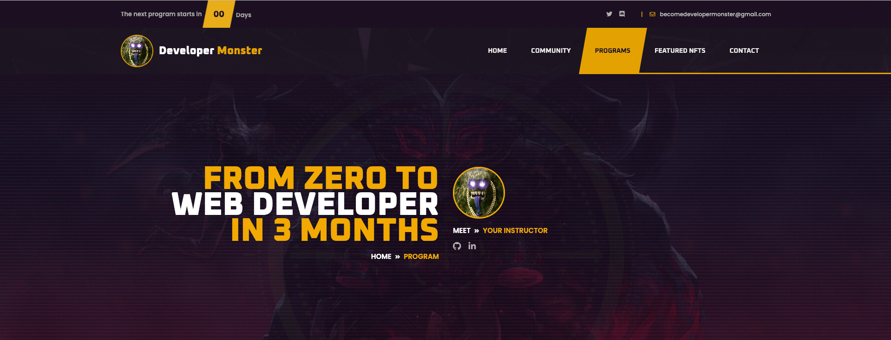

# ⚡️ Dev-Monster

## 📒 Table of contents
1. [What is this](#-what-is-this)
2. [How to install](#%EF%B8%8F-how-to-install)
3. [How to use](#%EF%B8%8F-how-to-use)
4. [Improvements Ideas](#-improvements-ideas)
5. [Screenshots](#%EF%B8%8F-screenshots)

### ⚡️ What is this
- These are HTML/CSS/JS landing pages, the idea is to give one to one coding classes, so here is the value proposal
- I took the initial file from a template I bought in envato market [here](https://themeforest.net/item/geco-esports-gaming-html5-template/26217041), I am over writting the code to adapt It to my idea
- The templates use bootstrap, jquery and other JS dependencies
- Fully responsive design
- The way I am planning to deploy this is: Open a hosting, install wordpress, install a clean templeate like underscore and upload each page one by one, and link correctly the dependencias and anchor links
- The reason to choose wordpress is because I want to manage newsletters with mailchimp, connect contact form and add easily whatsapp chat using plugins + Connect calendly to schedule the classes

### ⚙️ How to install
- Clone this repo: `git clone https://github.com/RolandoDrRobot/Dev-Monster.git`
- Go to `Geco` and open any html file you want to see

### ⚙️ How to use
- The pages in the folder `Geco/layouts` are the original templates
- I am working on the pages in `Geco/`

### 📒 Improvements Ideas
- Complete blog page and blog content page
- Upload articles to the blog

### 📕 Tech debt
- Complete section `Happy Members`
- Deploy in wordpress (Soon)
- Connect contact form
- Connect newsletter (mailchimp)
- Connect Whatsapp chat

### ⚡️ Screenshots - pages in progress

